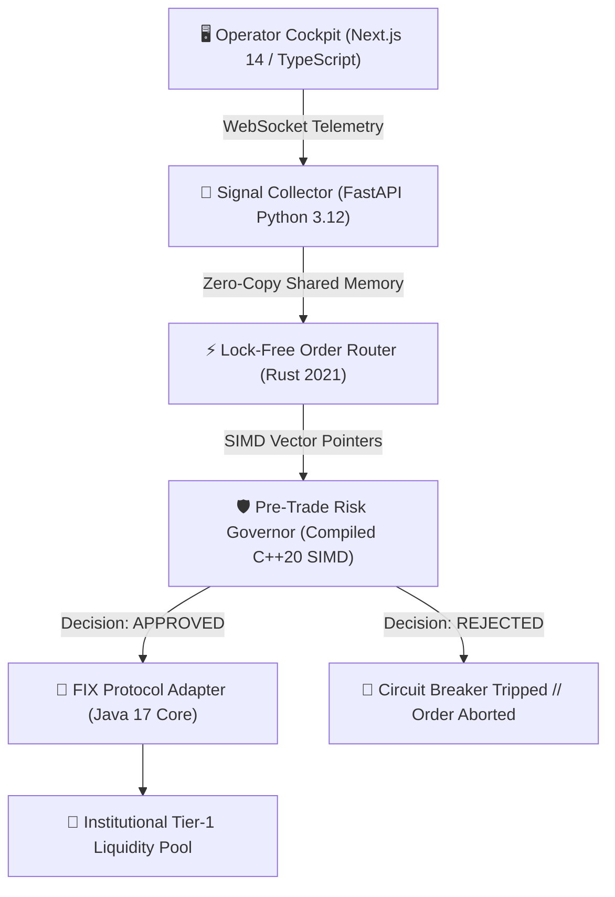

# Quantum-Execution-Engine: Multi-Language Low-Latency HFT Router & Risk Kernel

**Ultra-low-latency quantitative routing node** that spans five language runtimes.  
Each boundary is deliberately chosen for its strengths: TypeScript for the cockpit, Python for signal collection, Rust for lock-free routing, C++20 for SIMD risk math, and Java 17 for institutional FIX connectivity.

> Proprietary production binaries, market-data adapters, and live liquidity credentials remain private.  
> This repository is an architectural showcase of polyglot systems design for elite quantitative infrastructure roles.

---

## Multi-Language Data Pipeline

---

## Language Boundary Rationale

| Layer | Language | Why this runtime |
|-------|----------|------------------|
| **Web Cockpit** | Next.js 14 / TypeScript | Lightweight, non-blocking UI with native WebSocket streaming and Tailwind for dense real-time tables. Zero server-side blocking on the critical path. |
| **Signal Collector** | Python 3.12 / FastAPI | Rapid schema validation and orchestration. Not on the hot path. |
| **Execution Router** | Rust | Async, lock-free concurrent structures (Tokio + crossbeam / ring buffers). Ownership model eliminates data races while keeping sub-50 µs routing. |
| **Risk Kernel** | C++20 | Hardware-level SIMD (`std::experimental::simd` / compiler intrinsics) for sub-microsecond portfolio drawdown checks. Strict memory alignment and atomic operations without heavy locks. |
| **FIX Adapter** | Java 17 | Mature multi-threaded object pooling and binary protocol handling. Object pools + buffer recycling keep GC pauses out of the critical path under high message rates. |

---

## Design Principles

- **Fail-closed risk** — any drawdown breach aborts the order before it reaches the FIX layer.
- **Zero-copy handoffs** where language boundaries allow (shared memory / IPC pipes).
- **Deterministic latency budgets** — each stage declares its maximum acceptable processing time.
- **Explicit ownership and pooling** — no hidden allocations on the hot path.

---

## Repository Layout

Quantum-Execution-Engine/
├── README.md
├── risk_kernel.cpp          # C++20 SIMD risk governor
├── order_router.rs          # Rust lock-free router
├── FixAdapter.java          # Java 17 FIX object-pool adapter
└── DashboardComponent.tsx   # Next.js 14 live latency dashboard
---

## Attribution

Architected by a Polyglot Systems Architect.  
This repository demonstrates mastery across low-level memory control and modern frontend frameworks.

*Protected under proprietary guidelines. All rights reserved.*
